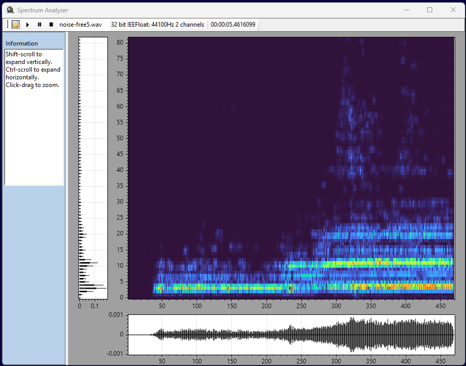

# SpectrumAnalyzer
This is a utility for drilling into spectral details of an audio or similar signal file.
It provides a visual representation of the frequency spectrum over time, allowing users to analyze and identify specific frequency.

Next steps:
1. Add sound output for the selected file.
2. Add ability to select a rectangular area on the heatmap and drill into it further, loading the data into a new instance of the form.

Here is an image of the UI layout:

