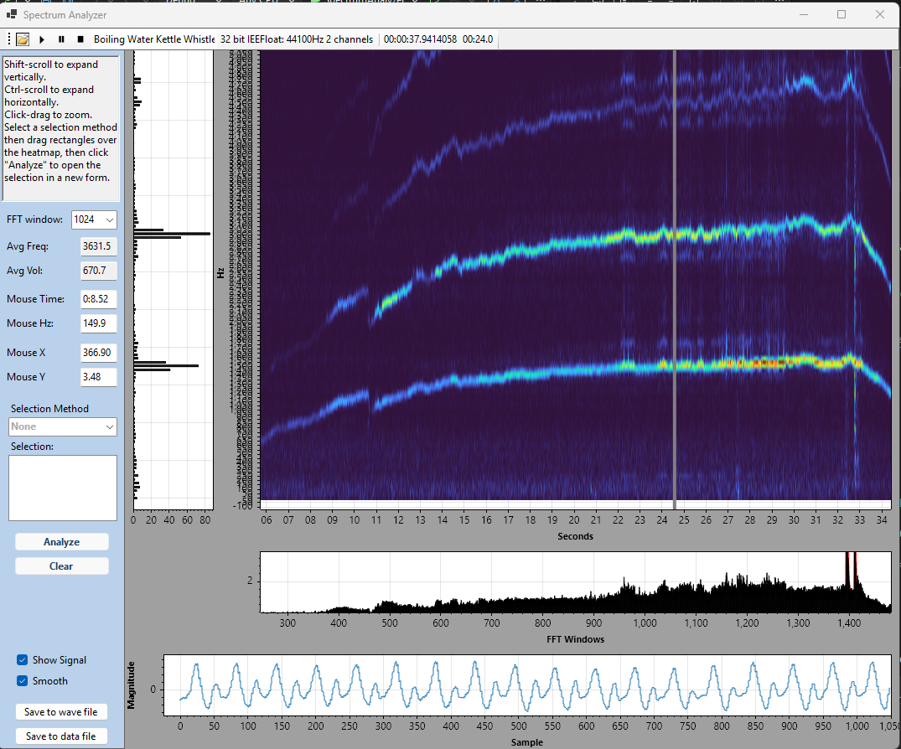

# SpectrumAnalyzer
This is a utility for drilling into spectral details of an audio or similar signal file.
It provides a visual representation of the frequency spectrum over time, allowing users to drill into, analyze, and inspect specific frequencies.

Recent changes:
1. Added sound output for the selected file.
2. Fixed axis labels to represent frequenct and time.
3. Added multiple ways to select a rectangular area on the heatmap and drill into it further, loading the data into a new instance of the form.
4. Added the ability to select parts of theaudio data and save as a new wav file.

Here is an image of the UI layout:

Thanks to Scott Harden for his fantastic open source ScottPlot Library and FftSharp Library!  [Scottplot.net](https://scottplot.net/)
Thanks to Mark Heath for his open source NAudio project.   [github/NAudio](https://github.com/naudio/NAudio)
